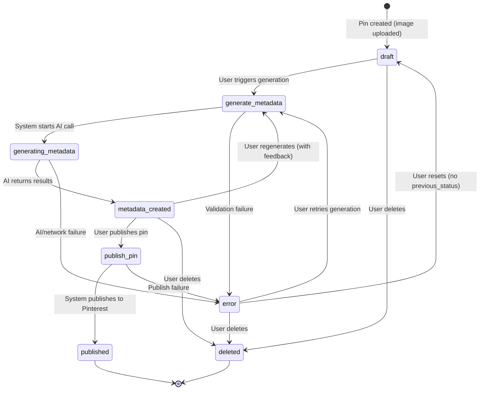

# Pin Status Flow

## State Diagram

## Status Reference

| Status | Display Label (DE) | Color | Managed By | Description |
|---|---|---|---|---|
| `draft` | Entwurf | slate | User | Initial state after pin creation |
| `generate_metadata` | Metadaten generieren | violet | User | User has requested generation |
| `generating_metadata` | Metadaten werden generiert | violet | System | AI generation in progress |
| `metadata_created` | Metadaten erstellt | teal | System | AI metadata applied to pin |
| `publish_pin` | Wird veroffentlicht | green | User | User triggered publish, in progress |
| `published` | Veroffentlicht | emerald | System | Live on Pinterest |
| `error` | Fehler | red | System | Failed operation, recoverable |
| `deleted` | Loschen | gray | User | Soft-deleted |

## Notes

- **System-managed statuses** (`generating_metadata`, `published`) cannot be set by users in the UI
- **Error recovery** restores `previous_status` if available, otherwise falls back to `draft`
- **Publishing** is triggered manually by the user (no scheduling queue)
