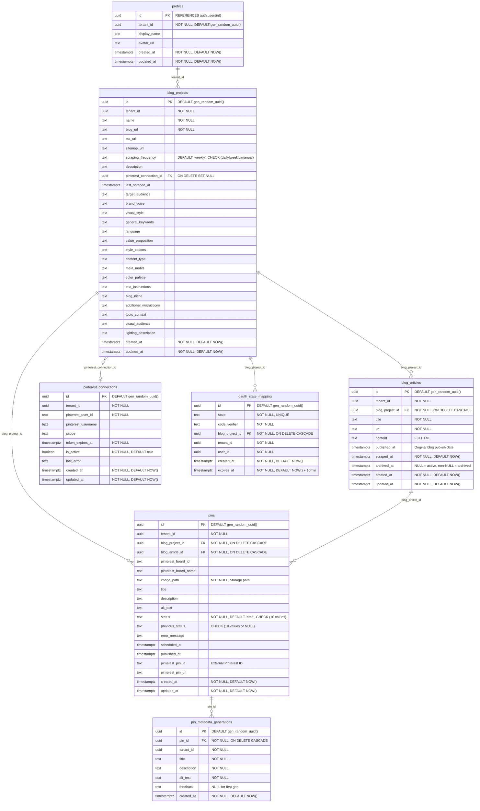
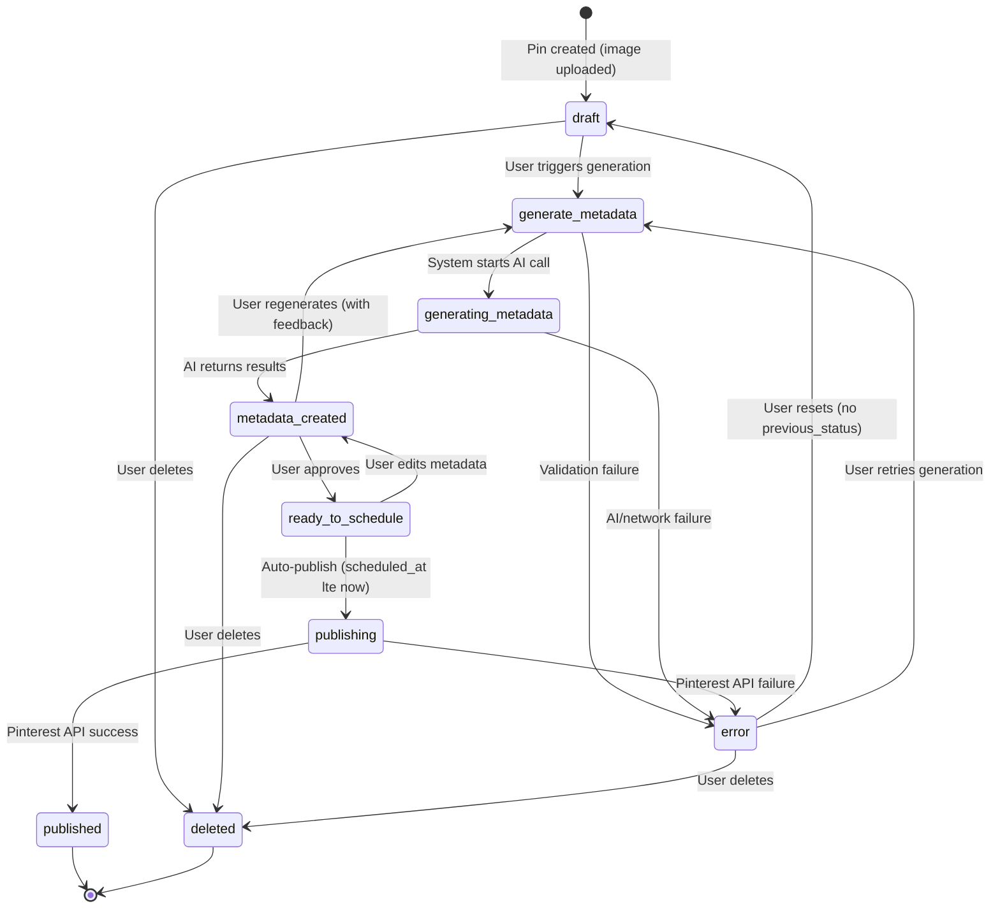

# Data Model

## Entity Relationship Diagram



## Table Details

### profiles

Extends `auth.users`. Each user gets a `tenant_id` for multi-tenant isolation.

| Index | Columns | Type |
|---|---|---|
| `profiles_pkey` | `id` | PRIMARY KEY |
| `idx_profiles_tenant_id` | `tenant_id` | btree |

| RLS Policy | Operation | Rule |
|---|---|---|
| Users can view own profile | SELECT | `auth.uid() = id` |
| Users can update own profile | UPDATE | `auth.uid() = id` |

---

### blog_projects

Blog projects with branding metadata. 16 branding text columns support AI pin generation prompts.

| Index | Columns | Type |
|---|---|---|
| `blog_projects_pkey` | `id` | PRIMARY KEY |
| `idx_blog_projects_tenant_id` | `tenant_id` | btree |

| RLS Policy | Operation | Rule |
|---|---|---|
| Users can view own tenant blog projects | SELECT | tenant isolation |
| Users can insert blog projects in own tenant | INSERT | tenant isolation |
| Users can update own tenant blog projects | UPDATE | tenant isolation |
| Users can delete own tenant blog projects | DELETE | tenant isolation |

---

### blog_articles

Scraped blog posts. Soft-delete via `archived_at`. Unique constraint on `(blog_project_id, url)` enables upsert on re-scrape.

| Index | Columns | Type |
|---|---|---|
| `blog_articles_pkey` | `id` | PRIMARY KEY |
| `idx_blog_articles_project_url` | `(blog_project_id, url)` | UNIQUE |
| `idx_blog_articles_tenant_id` | `tenant_id` | btree |
| `idx_blog_articles_blog_project_id` | `blog_project_id` | btree |
| `idx_blog_articles_published_at` | `published_at DESC` | btree |
| `idx_blog_articles_archived_at` | `archived_at` | btree |

| RLS Policy | Operation | Rule |
|---|---|---|
| Users can view own tenant blog articles | SELECT | tenant isolation |
| Users can insert blog articles in own tenant | INSERT | tenant isolation |
| Users can update own tenant blog articles | UPDATE | tenant isolation |
| Users can delete own tenant blog articles | DELETE | tenant isolation |

---

### pins

Pinterest pins with a 10-state workflow. `image_path` references `pin-images` storage bucket. `previous_status` tracks the state before the current one for error recovery.

| Index | Columns | Type |
|---|---|---|
| `pins_pkey` | `id` | PRIMARY KEY |
| `idx_pins_tenant_id` | `tenant_id` | btree |
| `idx_pins_blog_project_id` | `blog_project_id` | btree |
| `idx_pins_blog_article_id` | `blog_article_id` | btree |
| `idx_pins_pinterest_board_id` | `pinterest_board_id` | btree |
| `idx_pins_status` | `status` | btree |
| `idx_pins_scheduled_at` | `scheduled_at` | btree |

| RLS Policy | Operation | Rule |
|---|---|---|
| Users can view own tenant pins | SELECT | tenant isolation |
| Users can insert pins in own tenant | INSERT | tenant isolation |
| Users can update own tenant pins | UPDATE | tenant isolation |
| Users can delete own tenant pins | DELETE | tenant isolation |
| Service role full access pins | ALL | `true` (for background jobs) |

---

### pin_metadata_generations

AI generation history per pin. Application layer retains last 3 generations. Immutable records (no `updated_at`).

| Index | Columns | Type |
|---|---|---|
| `pin_metadata_generations_pkey` | `id` | PRIMARY KEY |
| `idx_pin_metadata_generations_pin_created` | `(pin_id, created_at DESC)` | btree |

| RLS Policy | Operation | Rule |
|---|---|---|
| Users can view own tenant metadata generations | SELECT | tenant isolation |
| Users can insert metadata generations in own tenant | INSERT | tenant isolation |
| Users can delete own tenant metadata generations | DELETE | tenant isolation |

---

### pinterest_connections

Pinterest OAuth accounts. Tokens stored in Vault (not in this table). Unique on `(tenant_id, pinterest_user_id)`.

| Index | Columns | Type |
|---|---|---|
| `pinterest_connections_pkey` | `id` | PRIMARY KEY |
| `idx_pinterest_connections_tenant_user` | `(tenant_id, pinterest_user_id)` | UNIQUE |
| `idx_pinterest_connections_tenant_id` | `tenant_id` | btree |

| RLS Policy | Operation | Rule |
|---|---|---|
| Users can view own tenant pinterest connections | SELECT | tenant isolation |
| Users can insert pinterest connections in own tenant | INSERT | tenant isolation |
| Users can update own tenant pinterest connections | UPDATE | tenant isolation |
| Users can delete own tenant pinterest connections | DELETE | tenant isolation |
| Service role full access pinterest_connections | ALL | `true` (for background jobs) |

---

### oauth_state_mapping

Ephemeral OAuth CSRF/PKCE state. Entries auto-expire after 10 minutes.

| Index | Columns | Type |
|---|---|---|
| `oauth_state_mapping_pkey` | `id` | PRIMARY KEY |
| `oauth_state_mapping_state_key` | `state` | UNIQUE |
| `idx_oauth_state_mapping_state` | `state` | btree |

| RLS Policy | Operation | Rule |
|---|---|---|
| Users can access own oauth state mappings | ALL | `user_id = auth.uid()` |
| Service role full access oauth_state_mapping | ALL | `true` (for background jobs) |

## Pin Status Workflow



### Status Values

| Status | Description | Set By |
|---|---|---|
| `draft` | Initial state after pin image upload | User |
| `generate_metadata` | User requested AI metadata generation | User |
| `generating_metadata` | AI generation in progress | System |
| `metadata_created` | AI metadata applied to pin | System |
| `ready_to_schedule` | Approved and ready for scheduling | User |
| `publishing` | Being published to Pinterest | System |
| `published` | Live on Pinterest | System |
| `error` | Failed operation, recoverable via `previous_status` | System |
| `deleted` | Soft-deleted | User |

> `ready_for_generation` is defined in the CHECK constraint but currently unused in the workflow.

## Storage Buckets

### pin-images

Pin image files. Public reads, tenant-isolated writes.

| Property | Value |
|---|---|
| Bucket ID | `pin-images` |
| Public | Yes |
| Path pattern | `{tenant_id}/{pin_id}.{ext}` |

| Policy | Operation | Role | Rule |
|---|---|---|---|
| Pin images are publicly readable | SELECT | `public` | `bucket_id = 'pin-images'` |
| Users can upload pin images to own tenant folder | INSERT | `authenticated` | folder[1] = user's tenant_id |
| Users can update pin images in own tenant folder | UPDATE | `authenticated` | folder[1] = user's tenant_id |
| Users can delete pin images in own tenant folder | DELETE | `authenticated` | folder[1] = user's tenant_id |

### brand-kit

Brand assets (logos, fonts). Public reads, tenant-isolated writes.

| Property | Value |
|---|---|
| Bucket ID | `brand-kit` |
| Public | Yes |
| Path pattern | `{tenant_id}/{filename}` |

| Policy | Operation | Role | Rule |
|---|---|---|---|
| Brand kit files are publicly readable | SELECT | `public` | `bucket_id = 'brand-kit'` |
| Users can upload brand kit files to own tenant folder | INSERT | `authenticated` | folder[1] = user's tenant_id |
| Users can update brand kit files in own tenant folder | UPDATE | `authenticated` | folder[1] = user's tenant_id |
| Users can delete brand kit files in own tenant folder | DELETE | `authenticated` | folder[1] = user's tenant_id |

## Vault Secrets

Secrets are encrypted at rest using Supabase Vault (`supabase_vault` extension). No secrets are stored in environment variables or table columns.

### Pinterest Tokens (per connection)

| Secret name pattern | Content |
|---|---|
| `pinterest_access_token_{connection_id}` | OAuth access token |
| `pinterest_refresh_token_{connection_id}` | OAuth refresh token |

### Gemini API Keys (per project)

| Secret name pattern | Content |
|---|---|
| `gemini_api_key_{blog_project_id}` | Gemini API key for AI metadata generation |

### Infrastructure Secrets

| Secret name | Content |
|---|---|
| `project_url` | Supabase project URL (used by pg_cron) |
| `edge_function_anon_key` | Anon key for Edge Function invocations |

## RPC Functions

All functions use `SECURITY DEFINER` to bypass RLS and access Vault.

| Function | Parameters | Returns | Purpose |
|---|---|---|---|
| `ensure_profile_exists()` | — | `TABLE(tenant_id UUID)` | Create missing profile for pre-trigger users |
| `store_pinterest_tokens(...)` | `connection_id, access_token, refresh_token` | `void` | Store encrypted OAuth tokens |
| `get_pinterest_access_token(...)` | `connection_id` | `TEXT` | Retrieve decrypted access token |
| `get_pinterest_refresh_token(...)` | `connection_id` | `TEXT` | Retrieve decrypted refresh token |
| `delete_pinterest_tokens(...)` | `connection_id` | `void` | Remove both tokens |
| `store_gemini_api_key(...)` | `blog_project_id, api_key` | `void` | Store encrypted Gemini key |
| `get_gemini_api_key(...)` | `blog_project_id` | `TEXT` | Retrieve decrypted Gemini key |
| `delete_gemini_api_key(...)` | `blog_project_id` | `void` | Remove Gemini key |
| `has_gemini_api_key(...)` | `blog_project_id` | `BOOLEAN` | Check existence (no decryption) |

## Triggers

| Trigger | Table | Event | Function | Purpose |
|---|---|---|---|---|
| `on_auth_user_created` | `auth.users` | AFTER INSERT | `handle_new_user()` | Auto-create profile on signup |
| `set_profiles_updated_at` | `profiles` | BEFORE UPDATE | `handle_updated_at()` | Auto-set `updated_at` |
| `set_blog_projects_updated_at` | `blog_projects` | BEFORE UPDATE | `handle_updated_at()` | Auto-set `updated_at` |
| `set_blog_articles_updated_at` | `blog_articles` | BEFORE UPDATE | `handle_updated_at()` | Auto-set `updated_at` |
| `set_pins_updated_at` | `pins` | BEFORE UPDATE | `handle_updated_at()` | Auto-set `updated_at` |
| `set_pinterest_connections_updated_at` | `pinterest_connections` | BEFORE UPDATE | `handle_updated_at()` | Auto-set `updated_at` |
| `trg_update_previous_status` | `pins` | BEFORE UPDATE | `update_previous_status()` | Track status before change for error recovery |

## Cron Jobs (pg_cron)

| Job name | Schedule | Target | Purpose |
|---|---|---|---|
| `scrape-scheduled-daily` | `0 6 * * *` (daily 06:00 UTC) | Edge Function `scrape-scheduled` | Scrape blogs with `scraping_frequency = 'daily'` |
| `publish-scheduled-pins` | `*/10 7-23 * * *` (every 10 min, 07-23 UTC) | Edge Function `publish-scheduled-pins` | Publish pins where `scheduled_at <= NOW()` |

Both jobs use `net.http_post` to invoke Edge Functions, authenticating with the `edge_function_anon_key` from Vault.

## Multi-Tenancy Pattern

Every data table has a `tenant_id` column. RLS policies enforce isolation using:

```sql
tenant_id IN (
  SELECT tenant_id FROM public.profiles WHERE id = (SELECT auth.uid())
)
```

- **No foreign keys to `profiles.tenant_id`** — it lacks a unique constraint; RLS enforces the relationship
- **Storage buckets** use folder-based isolation: `{tenant_id}/...` with `storage.foldername(name)[1]` checks
- **Vault secrets** are keyed by entity ID (connection or project), accessed only via `SECURITY DEFINER` functions
- **`oauth_state_mapping`** uses `user_id = auth.uid()` instead of tenant isolation (user-scoped, not tenant-scoped)
- **`service_role` bypass policies** exist on `pins`, `pinterest_connections`, and `oauth_state_mapping` for background jobs
