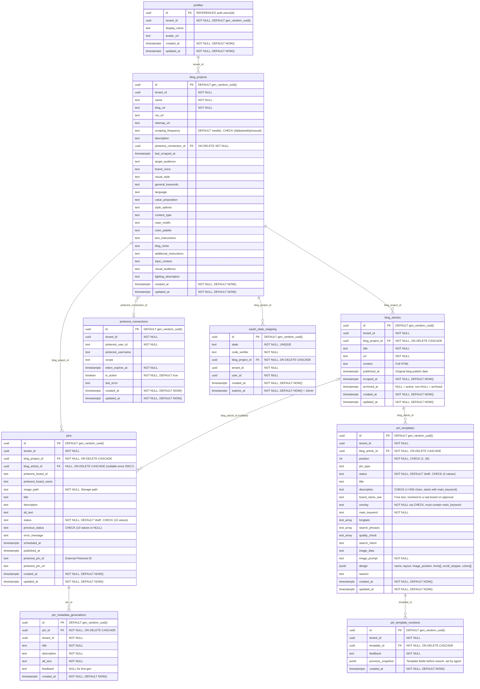
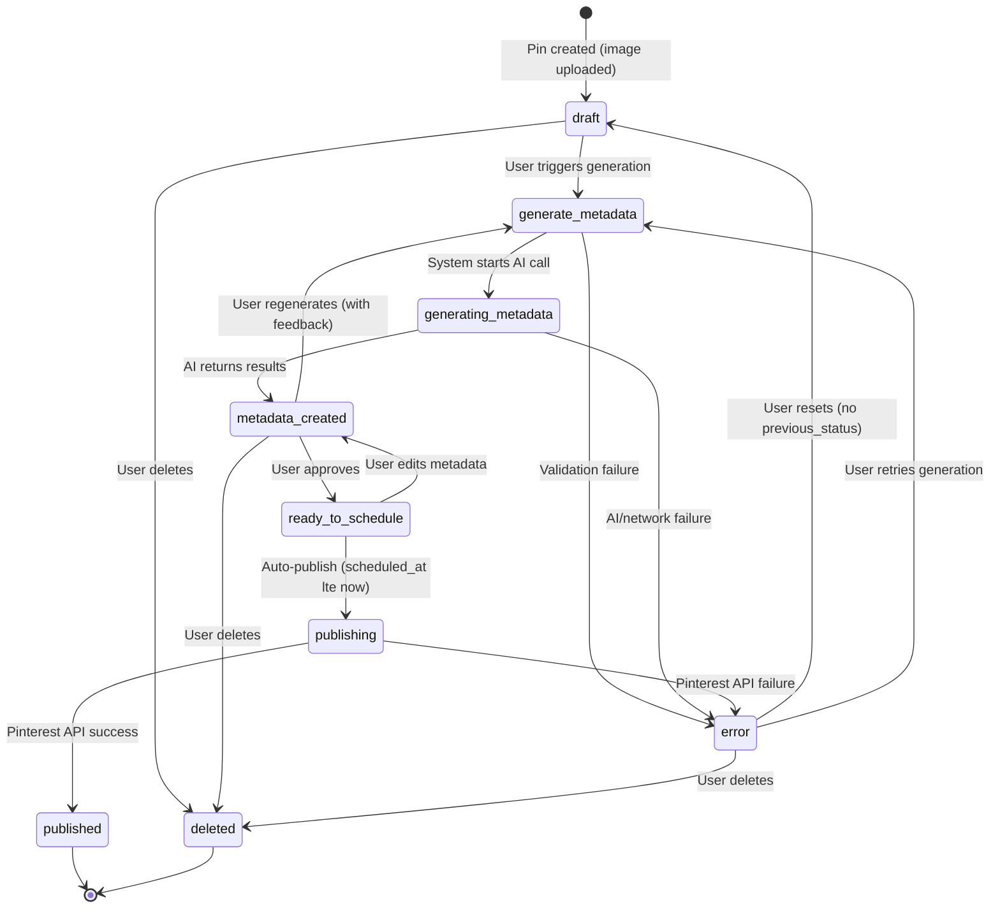

# Data Model

## Entity Relationship Diagram


```mermaid
erDiagram
    profiles {
        uuid id PK "REFERENCES auth.users(id)"
        uuid tenant_id "NOT NULL, DEFAULT gen_random_uuid()"
        text display_name
        text avatar_url
        timestamptz created_at "NOT NULL, DEFAULT NOW()"
        timestamptz updated_at "NOT NULL, DEFAULT NOW()"
    }

    blog_projects {
        uuid id PK "DEFAULT gen_random_uuid()"
        uuid tenant_id "NOT NULL"
        text name "NOT NULL"
        text blog_url "NOT NULL"
        text rss_url
        text sitemap_url
        text scraping_frequency "DEFAULT 'weekly', CHECK (daily|weekly|manual)"
        text description
        uuid pinterest_connection_id FK "ON DELETE SET NULL"
        timestamptz last_scraped_at
        text target_audience
        text brand_voice
        text visual_style
        text general_keywords
        text language
        text value_proposition
        text style_options
        text content_type
        text main_motifs
        text color_palette
        text text_instructions
        text blog_niche
        text additional_instructions
        text topic_context
        text visual_audience
        text lighting_description
        timestamptz created_at "NOT NULL, DEFAULT NOW()"
        timestamptz updated_at "NOT NULL, DEFAULT NOW()"
    }

    blog_articles {
        uuid id PK "DEFAULT gen_random_uuid()"
        uuid tenant_id "NOT NULL"
        uuid blog_project_id FK "NOT NULL, ON DELETE CASCADE"
        text title "NOT NULL"
        text url "NOT NULL"
        text content "Full HTML"
        timestamptz published_at "Original blog publish date"
        timestamptz scraped_at "NOT NULL, DEFAULT NOW()"
        timestamptz archived_at "NULL = active, non-NULL = archived"
        timestamptz created_at "NOT NULL, DEFAULT NOW()"
        timestamptz updated_at "NOT NULL, DEFAULT NOW()"
    }

    pins {
        uuid id PK "DEFAULT gen_random_uuid()"
        uuid tenant_id "NOT NULL"
        uuid blog_project_id FK "NOT NULL, ON DELETE CASCADE"
        uuid blog_article_id FK "NULL, ON DELETE CASCADE (nullable since 00017)"
        text pinterest_board_id
        text pinterest_board_name
        text image_path "NOT NULL, Storage path"
        text title
        text description
        text alt_text
        text status "NOT NULL, DEFAULT 'draft', CHECK (10 values)"
        text previous_status "CHECK (10 values or NULL)"
        text error_message
        timestamptz scheduled_at
        timestamptz published_at
        text pinterest_pin_id "External Pinterest ID"
        text pinterest_pin_url
        timestamptz created_at "NOT NULL, DEFAULT NOW()"
        timestamptz updated_at "NOT NULL, DEFAULT NOW()"
    }

    pin_metadata_generations {
        uuid id PK "DEFAULT gen_random_uuid()"
        uuid pin_id FK "NOT NULL, ON DELETE CASCADE"
        uuid tenant_id "NOT NULL"
        text title "NOT NULL"
        text description "NOT NULL"
        text alt_text "NOT NULL"
        text feedback "NULL for first gen"
        timestamptz created_at "NOT NULL, DEFAULT NOW()"
    }

    pinterest_connections {
        uuid id PK "DEFAULT gen_random_uuid()"
        uuid tenant_id "NOT NULL"
        text pinterest_user_id "NOT NULL"
        text pinterest_username
        text scope
        timestamptz token_expires_at "NOT NULL"
        boolean is_active "NOT NULL, DEFAULT true"
        text last_error
        timestamptz created_at "NOT NULL, DEFAULT NOW()"
        timestamptz updated_at "NOT NULL, DEFAULT NOW()"
    }

    oauth_state_mapping {
        uuid id PK "DEFAULT gen_random_uuid()"
        text state "NOT NULL, UNIQUE"
        text code_verifier "NOT NULL"
        uuid blog_project_id FK "NOT NULL, ON DELETE CASCADE"
        uuid tenant_id "NOT NULL"
        uuid user_id "NOT NULL"
        timestamptz created_at "NOT NULL, DEFAULT NOW()"
        timestamptz expires_at "NOT NULL, DEFAULT NOW() + 10min"
    }

    pin_templates {
        uuid id PK "DEFAULT gen_random_uuid()"
        uuid tenant_id "NOT NULL"
        uuid blog_article_id FK "NOT NULL, ON DELETE CASCADE"
        int position "NOT NULL, CHECK (1..30)"
        text pin_type
        text status "NOT NULL, DEFAULT 'draft', CHECK (4 values)"
        text title
        text description "CHECK (<=500 chars, starts with main_keyword)"
        text board_name_raw "Free text, resolved to a real board on approval"
        text overlay "NOT NULL via CHECK, must contain main_keyword"
        text main_keyword "NOT NULL"
        text_array longtails
        text_array search_phrases
        text_array quality_check
        text search_intent
        text image_idea
        text image_prompt "NOT NULL"
        jsonb design "name, layout, image_position, fonts[], scroll_stopper, colors[]"
        text season
        timestamptz created_at "NOT NULL, DEFAULT NOW()"
        timestamptz updated_at "NOT NULL, DEFAULT NOW()"
    }

    pin_template_revisions {
        uuid id PK "DEFAULT gen_random_uuid()"
        uuid tenant_id "NOT NULL"
        uuid template_id FK "NOT NULL, ON DELETE CASCADE"
        text feedback "NOT NULL"
        jsonb previous_snapshot "Template fields before rework, set by agent"
        timestamptz created_at "NOT NULL, DEFAULT NOW()"
    }

    profiles ||--o{ blog_projects : "tenant_id"
    blog_projects ||--o{ blog_articles : "blog_project_id"
    blog_projects ||--o{ pins : "blog_project_id"
    blog_projects }o--o| pinterest_connections : "pinterest_connection_id"
    blog_projects ||--o{ oauth_state_mapping : "blog_project_id"
    blog_articles |o--o{ pins : "blog_article_id (nullable)"
    pins ||--o{ pin_metadata_generations : "pin_id"
    blog_articles ||--o{ pin_templates : "blog_article_id"
    pin_templates ||--o{ pin_template_revisions : "template_id"
```

## Table Details

### profiles

Extends `auth.users`. Each user gets a `tenant_id` for multi-tenant isolation.

| Index | Columns | Type |
|---|---|---|
| `profiles_pkey` | `id` | PRIMARY KEY |
| `idx_profiles_tenant_id` | `tenant_id` | btree |

| RLS Policy | Operation | Rule |
|---|---|---|
| Users can view own profile | SELECT | `auth.uid() = id` |
| Users can update own profile | UPDATE | `auth.uid() = id` |

---

### blog_projects

Blog projects with branding metadata. 16 branding text columns support AI pin generation prompts.

| Index | Columns | Type |
|---|---|---|
| `blog_projects_pkey` | `id` | PRIMARY KEY |
| `idx_blog_projects_tenant_id` | `tenant_id` | btree |

| RLS Policy | Operation | Rule |
|---|---|---|
| Users can view own tenant blog projects | SELECT | tenant isolation |
| Users can insert blog projects in own tenant | INSERT | tenant isolation |
| Users can update own tenant blog projects | UPDATE | tenant isolation |
| Users can delete own tenant blog projects | DELETE | tenant isolation |

---

### blog_articles

Scraped blog posts. Soft-delete via `archived_at`. Unique constraint on `(blog_project_id, url)` enables upsert on re-scrape.

| Index | Columns | Type |
|---|---|---|
| `blog_articles_pkey` | `id` | PRIMARY KEY |
| `idx_blog_articles_project_url` | `(blog_project_id, url)` | UNIQUE |
| `idx_blog_articles_tenant_id` | `tenant_id` | btree |
| `idx_blog_articles_blog_project_id` | `blog_project_id` | btree |
| `idx_blog_articles_published_at` | `published_at DESC` | btree |
| `idx_blog_articles_archived_at` | `archived_at` | btree |

| RLS Policy | Operation | Rule |
|---|---|---|
| Users can view own tenant blog articles | SELECT | tenant isolation |
| Users can insert blog articles in own tenant | INSERT | tenant isolation |
| Users can update own tenant blog articles | UPDATE | tenant isolation |
| Users can delete own tenant blog articles | DELETE | tenant isolation |

---

### pins

Pinterest pins. `image_path` references `pin-images` storage bucket. `previous_status` tracks the state before the current one for error recovery. The status CHECK constraint allows 10 values, but the app only uses 7 — see [Pin Status Workflow](#pin-status-workflow). `blog_article_id` is nullable since migration 00017 (a pin no longer has to belong to an article); the FK still cascades on delete.

| Index | Columns | Type |
|---|---|---|
| `pins_pkey` | `id` | PRIMARY KEY |
| `idx_pins_tenant_id` | `tenant_id` | btree |
| `idx_pins_blog_project_id` | `blog_project_id` | btree |
| `idx_pins_blog_article_id` | `blog_article_id` | btree |
| `idx_pins_pinterest_board_id` | `pinterest_board_id` | btree |
| `idx_pins_status` | `status` | btree |
| `idx_pins_scheduled_at` | `scheduled_at` | btree |

| RLS Policy | Operation | Rule |
|---|---|---|
| Users can view own tenant pins | SELECT | tenant isolation |
| Users can insert pins in own tenant | INSERT | tenant isolation |
| Users can update own tenant pins | UPDATE | tenant isolation |
| Users can delete own tenant pins | DELETE | tenant isolation |
| Service role full access pins | ALL | `true` (for background jobs) |

---

### pin_metadata_generations

AI generation history per pin. Application layer retains last 3 generations. Immutable records (no `updated_at`).

| Index | Columns | Type |
|---|---|---|
| `pin_metadata_generations_pkey` | `id` | PRIMARY KEY |
| `idx_pin_metadata_generations_pin_created` | `(pin_id, created_at DESC)` | btree |

| RLS Policy | Operation | Rule |
|---|---|---|
| Users can view own tenant metadata generations | SELECT | tenant isolation |
| Users can insert metadata generations in own tenant | INSERT | tenant isolation |
| Users can delete own tenant metadata generations | DELETE | tenant isolation |

---

### pinterest_connections

Pinterest OAuth accounts. Tokens stored in Vault (not in this table). Unique on `(tenant_id, pinterest_user_id)`.

| Index | Columns | Type |
|---|---|---|
| `pinterest_connections_pkey` | `id` | PRIMARY KEY |
| `idx_pinterest_connections_tenant_user` | `(tenant_id, pinterest_user_id)` | UNIQUE |
| `idx_pinterest_connections_tenant_id` | `tenant_id` | btree |

| RLS Policy | Operation | Rule |
|---|---|---|
| Users can view own tenant pinterest connections | SELECT | tenant isolation |
| Users can insert pinterest connections in own tenant | INSERT | tenant isolation |
| Users can update own tenant pinterest connections | UPDATE | tenant isolation |
| Users can delete own tenant pinterest connections | DELETE | tenant isolation |
| Service role full access pinterest_connections | ALL | `true` (for background jobs) |

---

### oauth_state_mapping

Ephemeral OAuth CSRF/PKCE state. Entries auto-expire after 10 minutes.

| Index | Columns | Type |
|---|---|---|
| `oauth_state_mapping_pkey` | `id` | PRIMARY KEY |
| `oauth_state_mapping_state_key` | `state` | UNIQUE |
| `idx_oauth_state_mapping_state` | `state` | btree |

| RLS Policy | Operation | Rule |
|---|---|---|
| Users can access own oauth state mappings | ALL | `user_id = auth.uid()` |
| Service role full access oauth_state_mapping | ALL | `true` (for background jobs) |

---

### pin_templates

Pin-Werkstatt templates ("Vorlagen"). Each template hangs directly off a blog
article (no campaign table in v1) via `blog_article_id` (`ON DELETE CASCADE`).
Templates are **created exclusively by an external agent** logged in as the
least-privilege role `pin_werkstatt_agent` (migration 00029, scoped per project
via `agent_project_access`);
the app only displays them, changes their `status`, and records revision
requests — template texts are never edited in the UI. Migrations
00026 (table), 00027 (validation), 00028 (revisions relationship).

The CHECK constraints from migration 00027 (`position BETWEEN 1 AND 30`,
`description <= 500` chars, `overlay` present and containing `main_keyword`,
`description` starting with `main_keyword` — all keyword matches use the
IMMUTABLE `pin_template_normalize(txt)` helper) are the DB-level rejection rules
of the agent ingest and are mirrored in TS at `src/lib/validation/pin-template.ts`.
See [`docs/pin-template-write-contract.md`](./pin-template-write-contract.md)
for the full **Agenten-Eingang** write contract (upsert on the natural key
`(blog_article_id, position)`; `tenant_id` derived from the article by trigger;
never overwrite
`approved`/`archived` rows; 30 templates per article, checked with a query, not a
constraint).

**Status values** (`status` CHECK):

| Status | Description |
|---|---|
| `draft` | New template awaiting review (Werkstatt "Offen") |
| `needs_revision` | Reviewer requested a change; agent reworks and sets back to `draft` (Werkstatt "Offen") |
| `approved` | Reviewer signed off (Werkstatt "Freigegeben") |
| `archived` | Set aside (Werkstatt "Archiv") |

| Index | Columns | Type |
|---|---|---|
| `pin_templates_pkey` | `id` | PRIMARY KEY |
| `idx_pin_templates_article_position` | `(blog_article_id, position)` | UNIQUE |
| `idx_pin_templates_tenant_id` | `tenant_id` | btree |
| `idx_pin_templates_blog_article_id` | `blog_article_id` | btree |
| `idx_pin_templates_status` | `status` | btree |

| RLS Policy | Operation | Rule |
|---|---|---|
| Users can view own tenant pin templates | SELECT | tenant isolation |
| Users can insert pin templates in own tenant | INSERT | tenant isolation |
| Users can update own tenant pin templates | UPDATE | tenant isolation |
| Users can delete own tenant pin templates | DELETE | tenant isolation |
| Service role full access pin_templates | ALL | `true` (background jobs, admin) |
| Agent reads templates of granted projects | SELECT | `pin_werkstatt_agent`, article in `agent_project_access` |
| Agent inserts templates for granted projects | INSERT | `pin_werkstatt_agent`, article in `agent_project_access` |
| Agent updates templates of granted projects | UPDATE | `pin_werkstatt_agent`, article in `agent_project_access` |

Triggers `set_pin_templates_tenant_id` (derives `tenant_id` from the article) and
`guard_pin_templates_agent_writes` (agent may not change `approved`/`archived`
rows and may only write `draft`/`needs_revision`) come from migration 00029.

Trigger `set_pin_templates_updated_at` (BEFORE UPDATE) keeps `updated_at` current.

---

### pin_template_revisions

Immutable log of revision requests a reviewer sends to the external agent for a
pin template (migration 00028). Submitting a request inserts a row here and moves
the template to `needs_revision`; the agent picks up open requests, reworks the
template (writing `previous_snapshot`), and sets the status back to `draft`.
Immutable records (no `updated_at`); the application layer keeps only the last 3
rows per template. `template_id` references `pin_templates(id)` `ON DELETE
CASCADE`. `previous_snapshot` (jsonb, nullable) holds the template fields before
the rework and is written by the agent, not the app.

| Index | Columns | Type |
|---|---|---|
| `pin_template_revisions_pkey` | `id` | PRIMARY KEY |
| `idx_pin_template_revisions_template_created` | `(template_id, created_at DESC)` | btree |
| `idx_pin_template_revisions_tenant_id` | `tenant_id` | btree |

| RLS Policy | Operation | Rule |
|---|---|---|
| Users can view own tenant pin template revisions | SELECT | tenant isolation |
| Users can insert pin template revisions in own tenant | INSERT | tenant isolation |
| Users can delete own tenant pin template revisions | DELETE | tenant isolation (retention pruning) |
| Service role full access pin_template_revisions | ALL | `true` (background jobs, admin) |
| Agent reads revisions of granted projects | SELECT | `pin_werkstatt_agent`, template in a granted project |
| Agent updates revisions of granted projects | UPDATE | `pin_werkstatt_agent`, column grant on `previous_snapshot` only |

## Pin Status Workflow


```mermaid
stateDiagram-v2
    [*] --> draft : Pin created (image uploaded)

    draft --> generate_metadata : User triggers generation
    draft --> deleted : User deletes

    generate_metadata --> generating_metadata : System starts AI call
    generate_metadata --> error : Validation failure

    generating_metadata --> metadata_created : AI returns results
    generating_metadata --> error : AI/network failure

    metadata_created --> generate_metadata : User regenerates (with feedback)
    metadata_created --> ready_to_schedule : User approves
    metadata_created --> deleted : User deletes

    ready_to_schedule --> publishing : Auto-publish (scheduled_at lte now)
    ready_to_schedule --> metadata_created : User edits metadata

    publishing --> published : Pinterest API success
    publishing --> error : Pinterest API failure

    published --> [*]

    error --> draft : User resets (no previous_status)
    error --> generate_metadata : User retries generation
    error --> deleted : User deletes

    deleted --> [*]
```

### Status Values

The `pins_status_check` CHECK constraint (migrations 00007 + 00009) allows **10**
values. The application, however, only defines and uses **7** of them in the
`PinStatus` type (`src/types/pins.ts`). The three remaining values exist in the
constraint but are never set or rendered by this app.

| Status | Description | Set By | In app (`PinStatus`)? |
|---|---|---|---|
| `draft` | Initial state after pin image upload | User | Yes |
| `generate_metadata` | User requested AI metadata generation | User | Yes |
| `generating_metadata` | AI generation in progress | System | Yes |
| `metadata_created` | AI metadata applied to pin | System | Yes |
| `published` | Live on Pinterest | System | Yes |
| `error` | Failed operation, recoverable via `previous_status` | System | Yes |
| `deleted` | Soft-deleted | User | Yes |
| `ready_for_generation` | — | — | No (constraint only) |
| `ready_to_schedule` | — | — | No (constraint only) |
| `publishing` | — | — | No (constraint only) |

> **Deviation from the CHECK constraint.** `ready_for_generation`,
> `ready_to_schedule`, and `publishing` are part of the constraint but are not in
> the `PinStatus` type and are never written by the app. Publishing happens in
> n8n (see project overview), which writes `published` directly
> (`src/lib/server/pinterest-publishing.ts` sets `status: 'published'`), so the
> intermediate `publishing`/`ready_to_schedule` states are skipped. The
> constraint is intentionally left permissive so those historical/reserved
> values remain valid; the workflow diagram above shows the full intended flow,
> not the subset the app currently drives.

## Storage Buckets

### pin-images

Pin image files. Public reads, tenant-isolated writes.

| Property | Value |
|---|---|
| Bucket ID | `pin-images` |
| Public | Yes |
| Path pattern | `{tenant_id}/{pin_id}.{ext}` |

| Policy | Operation | Role | Rule |
|---|---|---|---|
| Pin images are publicly readable | SELECT | `public` | `bucket_id = 'pin-images'` |
| Users can upload pin images to own tenant folder | INSERT | `authenticated` | folder[1] = user's tenant_id |
| Users can update pin images in own tenant folder | UPDATE | `authenticated` | folder[1] = user's tenant_id |
| Users can delete pin images in own tenant folder | DELETE | `authenticated` | folder[1] = user's tenant_id |

### brand-kit

Brand assets (logos, fonts). Public reads, tenant-isolated writes.

| Property | Value |
|---|---|
| Bucket ID | `brand-kit` |
| Public | Yes |
| Path pattern | `{tenant_id}/{filename}` |

| Policy | Operation | Role | Rule |
|---|---|---|---|
| Brand kit files are publicly readable | SELECT | `public` | `bucket_id = 'brand-kit'` |
| Users can upload brand kit files to own tenant folder | INSERT | `authenticated` | folder[1] = user's tenant_id |
| Users can update brand kit files in own tenant folder | UPDATE | `authenticated` | folder[1] = user's tenant_id |
| Users can delete brand kit files in own tenant folder | DELETE | `authenticated` | folder[1] = user's tenant_id |

## Vault Secrets

Secrets are encrypted at rest using Supabase Vault (`supabase_vault` extension). No secrets are stored in environment variables or table columns.

### Pinterest Tokens (per connection)

| Secret name pattern | Content |
|---|---|
| `pinterest_access_token_{connection_id}` | OAuth access token |
| `pinterest_refresh_token_{connection_id}` | OAuth refresh token |

### Gemini API Keys (per project)

| Secret name pattern | Content |
|---|---|
| `gemini_api_key_{blog_project_id}` | Gemini API key for AI metadata generation |

### Infrastructure Secrets

| Secret name | Content |
|---|---|
| `project_url` | Supabase project URL (used by pg_cron) |
| `edge_function_anon_key` | Anon key for Edge Function invocations |

## RPC Functions

All functions use `SECURITY DEFINER` to bypass RLS and access Vault.

| Function | Parameters | Returns | Purpose |
|---|---|---|---|
| `ensure_profile_exists()` | — | `TABLE(tenant_id UUID)` | Create missing profile for pre-trigger users |
| `store_pinterest_tokens(...)` | `connection_id, access_token, refresh_token` | `void` | Store encrypted OAuth tokens |
| `get_pinterest_access_token(...)` | `connection_id` | `TEXT` | Retrieve decrypted access token |
| `get_pinterest_refresh_token(...)` | `connection_id` | `TEXT` | Retrieve decrypted refresh token |
| `delete_pinterest_tokens(...)` | `connection_id` | `void` | Remove both tokens |
| `store_gemini_api_key(...)` | `blog_project_id, api_key` | `void` | Store encrypted Gemini key |
| `get_gemini_api_key(...)` | `blog_project_id` | `TEXT` | Retrieve decrypted Gemini key |
| `delete_gemini_api_key(...)` | `blog_project_id` | `void` | Remove Gemini key |
| `has_gemini_api_key(...)` | `blog_project_id` | `BOOLEAN` | Check existence (no decryption) |
| `enqueue_generate_metadata(...)` | `pin_ids UUID[]` | `INTEGER` | Tenant-checked (all or nothing): set pins to `generating_metadata` and enqueue them on `generate_metadata`. Callable by `authenticated` |
| `try_acquire_queue_worker_lock(...)` | `queue, ttl_seconds` | `BOOLEAN` | Take the expiring per-queue worker lock. `service_role` only |
| `release_queue_worker_lock(...)` | `queue` | `void` | Release the worker lock. `service_role` only |
| `queue_read(...)` | `queue, vt, qty` | `SETOF pgmq.message_record` | Wrapper around `pgmq.read`. `service_role` only |
| `queue_delete(...)` | `queue, msg_id` | `BOOLEAN` | Wrapper around `pgmq.delete`. `service_role` only |
| `queue_archive(...)` | `queue, msg_id` | `BOOLEAN` | Wrapper around `pgmq.archive`. `service_role` only |
| `kick_queue_worker(...)` | `queue, function` | `void` | Called by pg_cron: invoke the worker Edge Function if visible messages wait and the lock is free |

## Triggers

| Trigger | Table | Event | Function | Purpose |
|---|---|---|---|---|
| `on_auth_user_created` | `auth.users` | AFTER INSERT | `handle_new_user()` | Auto-create profile on signup |
| `set_profiles_updated_at` | `profiles` | BEFORE UPDATE | `handle_updated_at()` | Auto-set `updated_at` |
| `set_blog_projects_updated_at` | `blog_projects` | BEFORE UPDATE | `handle_updated_at()` | Auto-set `updated_at` |
| `set_blog_articles_updated_at` | `blog_articles` | BEFORE UPDATE | `handle_updated_at()` | Auto-set `updated_at` |
| `set_pins_updated_at` | `pins` | BEFORE UPDATE | `handle_updated_at()` | Auto-set `updated_at` |
| `set_pinterest_connections_updated_at` | `pinterest_connections` | BEFORE UPDATE | `handle_updated_at()` | Auto-set `updated_at` |
| `set_pin_templates_updated_at` | `pin_templates` | BEFORE UPDATE | `handle_updated_at()` | Auto-set `updated_at` |
| `trg_update_previous_status` | `pins` | BEFORE UPDATE | `update_previous_status()` | Track status before change for error recovery |

## Cron Jobs (pg_cron)

| Job name | Schedule | Target | Purpose |
|---|---|---|---|
| `scrape-scheduled-daily` | `0 6 * * *` (daily 06:00 UTC) | Edge Function `scrape-scheduled` | Scrape blogs with `scraping_frequency = 'daily'` |
| `publish-scheduled-pins` | `*/10 7-23 * * *` (every 10 min, 07-23 UTC) | Edge Function `publish-scheduled-pins` | Publish pins where `scheduled_at <= NOW()` |
| `cleanup-published-images` | `0 3 * * *` (daily 03:00 UTC) | Edge Function `cleanup-published-images` | Delete storage images of pins published more than 7 days ago |
| `kick-generate-metadata-worker` | `15 seconds` | `kick_queue_worker('generate_metadata', 'generate-metadata-worker')` | Start the metadata queue worker when messages wait and no run holds the lock |

All jobs use `net.http_post` to invoke Edge Functions, authenticating with the `edge_function_anon_key` from Vault. The queue kick calls it from inside `kick_queue_worker()`.

## Queues (pgmq)

Background jobs run on pgmq queues drained by Edge Function workers (ADR-0004).

| Queue | Message | Worker | Max attempts |
|---|---|---|---|
| `generate_metadata` | `{ pin_id, tenant_id }` | Edge Function `generate-metadata-worker` | 3 |

- A worker run takes the per-queue lock in `queue_worker_locks`, reads up to 5 messages with a 420s visibility timeout, deletes a message on success and leaves it for retry on failure.
- On the last attempt the message is moved to the queue's archive (`pgmq.a_<queue>`), the pin is set to `error` and one notification mail is sent. Inspect failures with `SELECT * FROM pgmq.a_generate_metadata ORDER BY archived_at DESC`.
- `queue_worker_locks` holds no tenant data: RLS is enabled without policies and table grants are revoked from `anon`/`authenticated`, so only `service_role` and the `SECURITY DEFINER` helpers touch it.

## Multi-Tenancy Pattern

Every data table has a `tenant_id` column. RLS policies enforce isolation using:

```sql
tenant_id IN (
  SELECT tenant_id FROM public.profiles WHERE id = (SELECT auth.uid())
)
```

- **No foreign keys to `profiles.tenant_id`** — it lacks a unique constraint; RLS enforces the relationship
- **Storage buckets** use folder-based isolation: `{tenant_id}/...` with `storage.foldername(name)[1]` checks
- **Vault secrets** are keyed by entity ID (connection or project), accessed only via `SECURITY DEFINER` functions
- **`oauth_state_mapping`** uses `user_id = auth.uid()` instead of tenant isolation (user-scoped, not tenant-scoped)
- **`service_role` bypass policies** exist on `pins`, `pinterest_connections`, `oauth_state_mapping`, `pin_templates`, and `pin_template_revisions` for background jobs
- **`pin_werkstatt_agent`** is the external Werkstatt agent's own Postgres role (migration 00029): no RLS bypass, scoped per project via `agent_project_access`. Setup and revocation: [`pin-werkstatt-agent-db-user.md`](./pin-werkstatt-agent-db-user.md)
