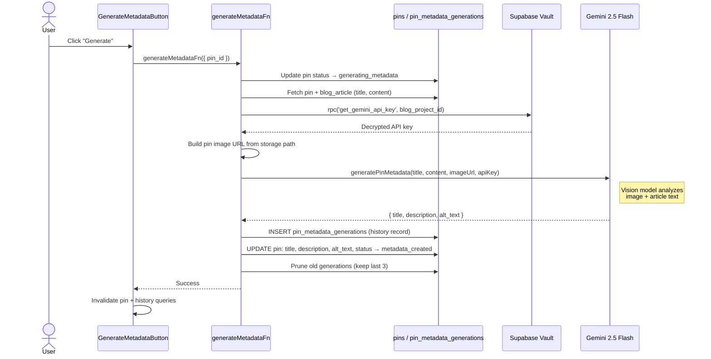
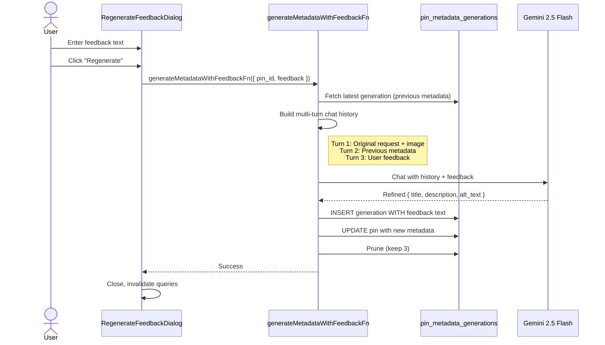
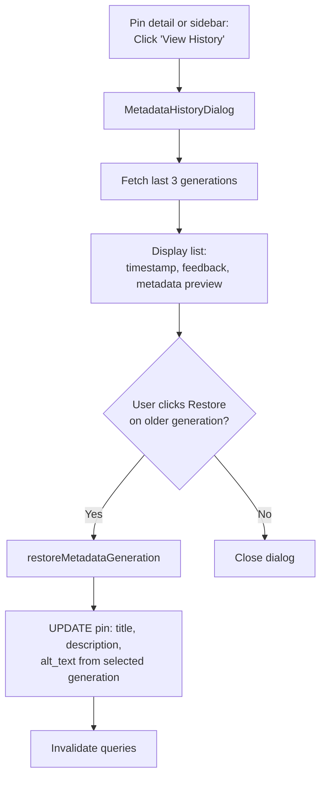
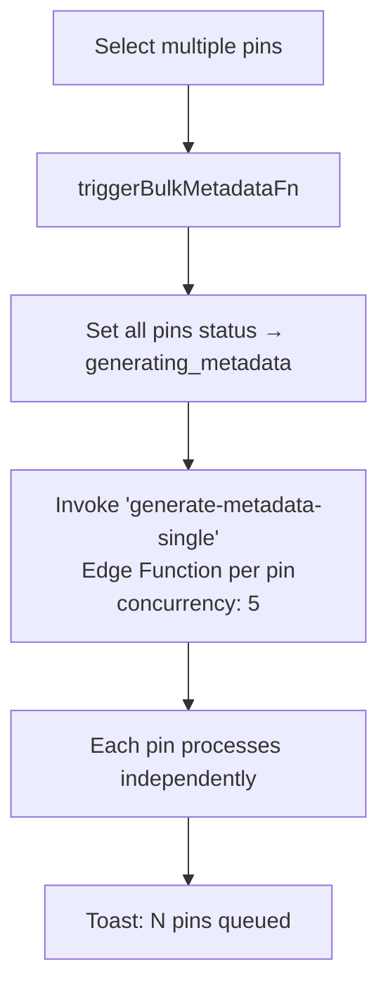

# AI Metadata Generation Flow

Generate pin titles, descriptions, and alt text using Gemini 2.5 Flash with vision. Supports initial generation, regeneration with user feedback, and history with restore.

**Prerequisite:** The project must have a Gemini API key stored in Supabase Vault. See [Gemini API Key](gemini-api-key.md).

## Generate Metadata

**Gemini prompt guidelines:**
- Title: max 100 characters, Pinterest SEO optimized
- Description: 220-232 characters with call-to-action
- Alt text: max 125 characters, accessibility-focused
- Article content truncated to 4000 characters

## Regenerate with Feedback

The feedback flow uses Gemini's multi-turn chat to replay the original generation context and apply the user's refinement instructions.

## View History & Restore

Each generation record shows:
- Timestamp
- "Current" badge (if most recent)
- Feedback text (if regenerated with feedback)
- Truncated title, description, alt_text preview
- Restore button (for non-current generations)

## Bulk Metadata Generation

For generating metadata across multiple pins at once:

The Edge Function mirrors the server function logic but runs asynchronously in the background.

## Button States

The `GenerateMetadataButton` adapts its UI based on pin state:

| State | UI |
|-------|----|
| No metadata generated | "Generate" button |
| `status === 'generating_metadata'` | Spinner + "Generating..." (all buttons disabled) |
| Has metadata | "Regenerate" + "View History" + "Regenerate with Feedback" |

## Key Files

| File | Purpose |
|------|---------|
| `src/components/pins/generate-metadata-button.tsx` | Context-aware button with generate/regenerate actions |
| `src/components/pins/metadata-history-dialog.tsx` | History list with restore capability |
| `src/components/pins/regenerate-feedback-dialog.tsx` | Feedback textarea + regenerate action |
| `src/lib/server/metadata.ts` | Server functions: generate, feedback, bulk trigger |
| `src/lib/gemini/client.ts` | Gemini API: `generatePinMetadata`, `generatePinMetadataWithFeedback` |
| `src/lib/api/metadata.ts` | Client API: `getMetadataHistory`, `restoreMetadataGeneration` |
| `src/lib/hooks/use-metadata.ts` | TanStack Query hooks for all metadata operations |
