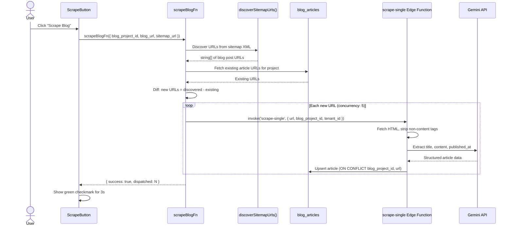
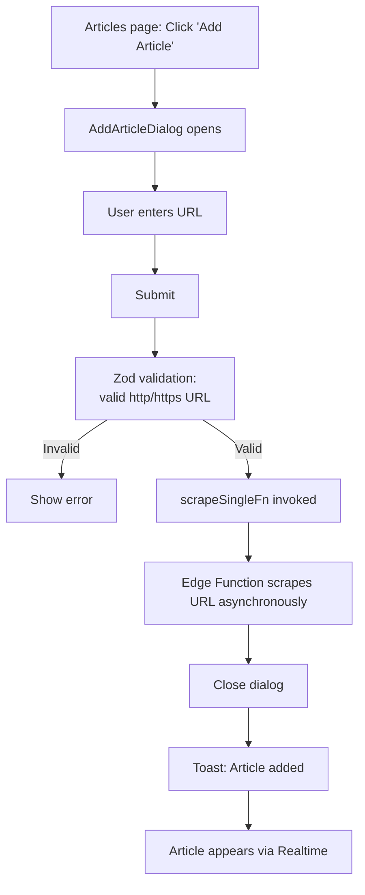
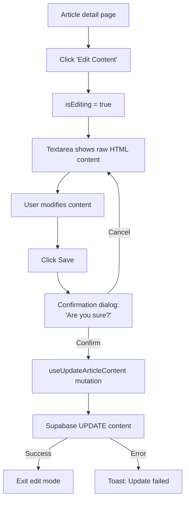
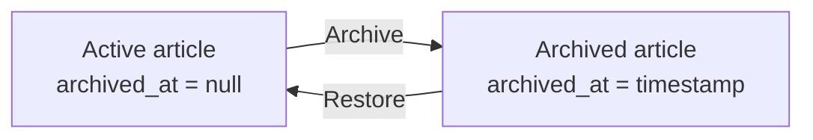

# Article Management Flow

Blog scraping, manual article addition, content editing, and archive/restore. Articles are scraped from blog sitemaps using Gemini-based extraction and stored for linking to pins.

## Bulk Scrape

The server function returns immediately after dispatching to Edge Functions (fire-and-forget). New articles appear via Supabase Realtime subscription on the articles table.

## Manual Add

## Content Editing

Content is rendered via `sanitizeHtml()` + `dangerouslySetInnerHTML` in view mode. The textarea uses monospace font for HTML editing.

## Archive / Restore

Articles use soft deletion via the `archived_at` timestamp column:

- **Archive:** Sets `archived_at = NOW()`, article hidden from active list
- **Restore:** Sets `archived_at = null`, article returns to active list
- Articles are never hard-deleted

The articles table has two tabs: "Active" (default) and "Archived". Both show title, date, pin count, source URL, and an action button (Archive or Restore).

## Articles Table Features

- **Sortable columns:** title, published_at, pin_count (derived), URL domain
- **Pin count badges:** Aggregated from the pins table per article
- **Realtime updates:** Listens for INSERT events to auto-refresh when scraping completes
- **Link to detail:** Clicking an article title navigates to the detail page

## Article Detail Page

Displays article metadata, content, and linked pins:

- **Metadata:** Published date, scraped date, pin count
- **Linked pins:** Up to 5 pins shown with "Load More" pagination
- **Content:** Sanitized HTML rendering with edit toggle
- **Actions:** Edit content, view original (external link), archive/restore

## Key Files

| File | Purpose |
|------|---------|
| `src/components/articles/scrape-button.tsx` | Bulk scrape trigger with loading/success/error states |
| `src/components/articles/add-article-dialog.tsx` | Manual URL input with Zod validation |
| `src/components/articles/articles-table.tsx` | Sortable table with active/archived tabs |
| `src/routes/_authed/projects/$projectId/articles/index.tsx` | Articles list page |
| `src/routes/_authed/projects/$projectId/articles/$articleId.tsx` | Article detail with content editing |
| `src/lib/server/scraping.ts` | Server functions: `scrapeBlogFn`, `scrapeSingleFn` |
| `server/lib/scraping.ts` | Sitemap discovery: `discoverSitemapUrls()` |
| `src/lib/api/articles.ts` | API: CRUD, archive/restore, content update |
| `src/lib/hooks/use-articles.ts` | TanStack Query hooks with realtime invalidation |
