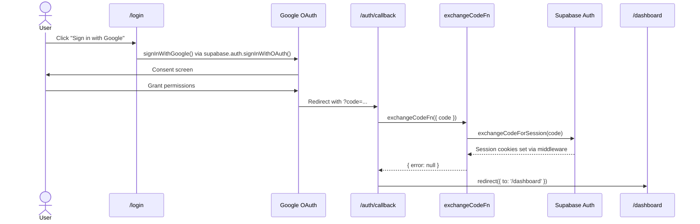
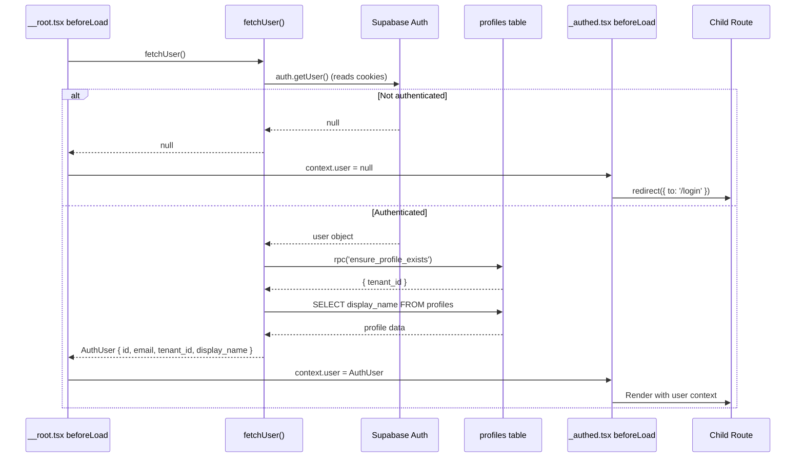
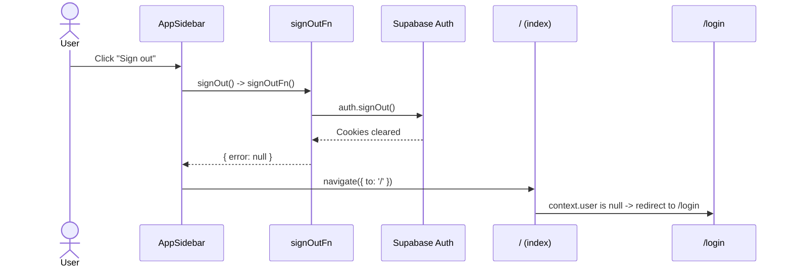

# Authentication Flow

Google OAuth login via Supabase Auth with cookie-based session management. All protected routes live under the `_authed/` layout which enforces authentication.

## Login Flow

## Session Initialization (Every Route Load)

## Logout Flow

## Auth Guard

The `_authed.tsx` layout route protects all child routes. It runs `beforeLoad` on every navigation:

1. Checks `context.user` (set by `__root.tsx`)
2. If `null` -> redirects to `/login`
3. If present -> passes user to child routes via `useRouteContext()`

The layout wraps children in `SidebarProvider` + `AppSidebar` for the authenticated shell.

## Profile Auto-Creation

New users get a profile automatically via two mechanisms:

- **Database trigger:** `on_auth_user_created` fires after Supabase Auth signup, inserting into `profiles` with a new `tenant_id`
- **Fallback RPC:** `ensure_profile_exists()` creates the profile on-demand if the trigger hasn't fired yet (race condition handling)

## Key Files

| File | Purpose |
|------|---------|
| `src/routes/login.tsx` | Login page with Google OAuth button |
| `src/routes/auth.callback.tsx` | OAuth redirect handler, exchanges code for session |
| `src/routes/_authed.tsx` | Auth guard layout, redirects unauthenticated users |
| `src/routes/__root.tsx` | Root layout, runs `fetchUser()` on every navigation |
| `src/routes/index.tsx` | Root redirect (authenticated -> dashboard, else -> login) |
| `src/lib/server/auth.ts` | Server functions: `fetchUser`, `exchangeCodeFn`, `signOutFn` |
| `src/lib/auth.ts` | Client utilities: `signInWithGoogle`, `signOut`, `ensureProfile` |
| `src/components/layout/app-sidebar.tsx` | Sidebar with sign-out action |
