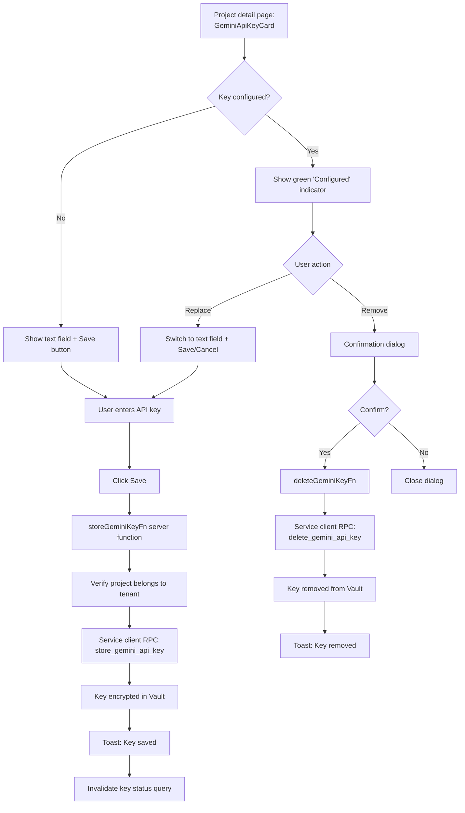
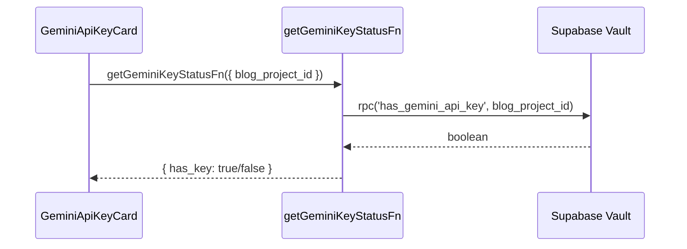

# Gemini API Key Management

Store, update, and remove per-project Gemini API keys via Supabase Vault. Keys are required for AI metadata generation.

## Store / Update Key

## Key Status Check

The component checks on mount whether a key is configured:

The actual key value is **never returned** to the client. Only the boolean status is exposed.

## UI States

| State | Display |
|-------|---------|
| Loading | Spinner |
| No key | Text field (password type) + Save button |
| Key configured | Green indicator + "Configured" + Replace/Remove buttons |
| Replacing | Text field (autofocus) + Save/Cancel buttons |

## Security

- Keys are encrypted at rest in Supabase Vault
- Only the service role client can read/write Vault secrets
- Server functions verify tenant ownership before any Vault operation
- Keys are named `gemini_api_key_{blog_project_id}` in Vault

## Usage

Once stored, the key is automatically used by:
- [AI Metadata Generation](ai-metadata-generation.md) - `generateMetadataFn` retrieves the key from Vault before calling Gemini
- Bulk metadata generation Edge Function

## Key Files

| File | Purpose |
|------|---------|
| `src/components/projects/gemini-api-key-card.tsx` | UI for key management |
| `src/lib/server/gemini-key.ts` | Server functions: store, delete, check status |
| `src/lib/hooks/use-gemini-key.ts` | TanStack Query hooks: `useGeminiKeyStatus`, `useStoreGeminiKey`, `useDeleteGeminiKey` |
