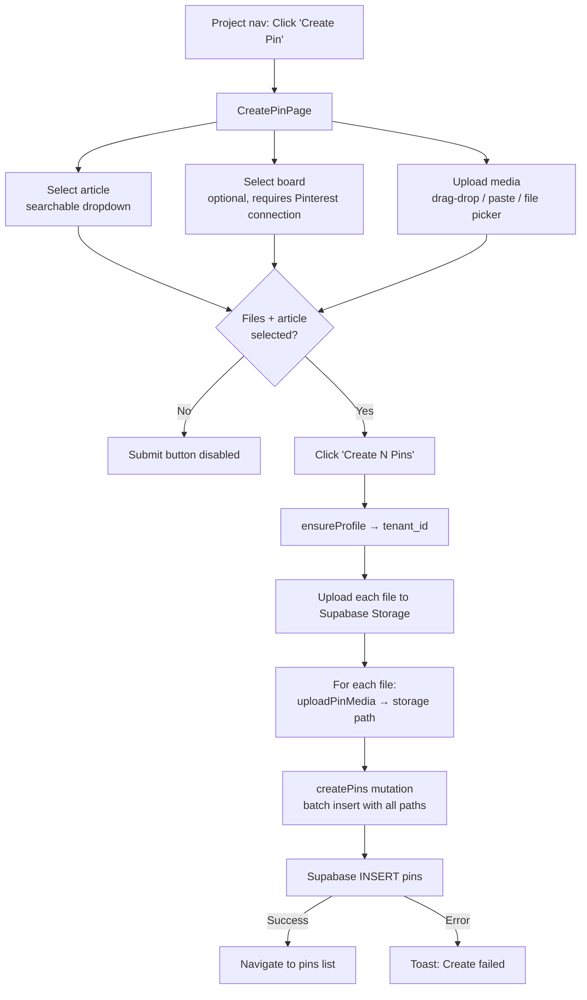

# Pin Creation Flow

Creating new pins with media upload. Each pin is linked to an article and optionally assigned to a Pinterest board. Multiple pins can be created at once from different media files.

## Create Pins



## Media Upload Details

The `MediaUploadZone` component supports multiple input methods:

| Method | Description |
|--------|-------------|
| Click | Opens file picker dialog |
| Drag & drop | Drop files onto the zone |
| Clipboard paste | Paste images from clipboard |

**Accepted types:** `image/*`, `video/mp4`, `video/quicktime`, `video/webm`

**Per-file features:**
- Thumbnail preview (video seeks to 0.5s for thumbnail)
- Dimensions display with aspect ratio warning if not ~2:3 portrait (0.6-0.7 ratio)
- File size display (formatted as B/KB/MB)
- "VIDEO" badge for video files
- Individual remove button

**Storage path format:** `{tenant_id}/{uuid}.{extension}` in the `pin-images` bucket.

## Pin Insert Data

Each pin in the batch is created with:

```typescript
{
  blog_project_id: string    // From route params
  blog_article_id: string    // Selected article
  image_path: string         // Storage path from upload
  media_type: 'image' | 'video'  // Detected from MIME type
  pinterest_board_id?: string    // Optional board selection
  pinterest_board_name?: string  // Board display name
}
```

Pins are created with `status: 'draft'` by default. The `tenant_id` is added by the API function.

## Board Selection

- Board dropdown is disabled if Pinterest is not connected to the project
- Shows a warning alert if no connection exists
- Shows "No boards available" if connected but no boards found
- Board selection applies to all pins in the batch

## Key Files

| File | Purpose |
|------|---------|
| `src/routes/_authed/projects/$projectId/create-pin.tsx` | Create pin page with article/board/media selection |
| `src/components/pins/media-upload-zone.tsx` | Multi-file upload with drag-drop, paste, preview |
| `src/lib/api/pins.ts` | `uploadPinMedia`, `createPins` functions |
| `src/lib/hooks/use-pins.ts` | `useCreatePins` mutation hook |
| `src/types/pins.ts` | `Pin`, `PinInsert` type definitions |
