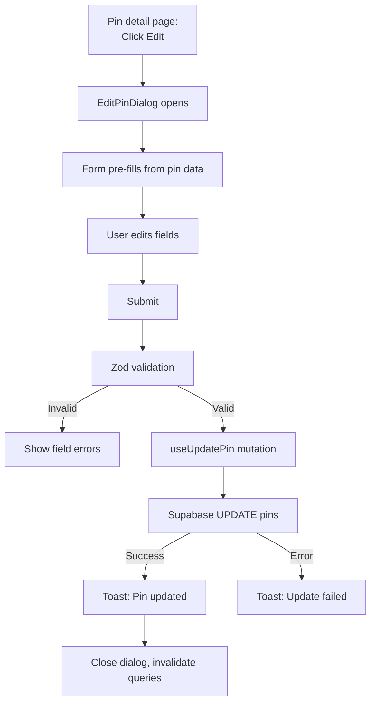
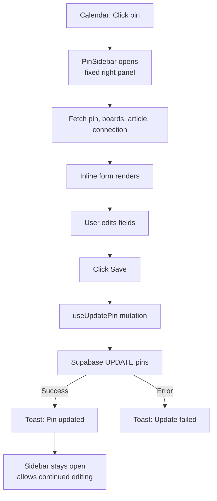
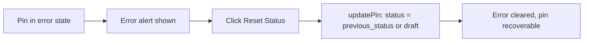

# Pin Editing Flow

Editing pin metadata, status, and board assignment. Pins can be edited from the detail page (via dialog) or from the calendar sidebar (inline form).

## Edit via Detail Page

## Edit via Calendar Sidebar

Key difference: the sidebar does **not** close after saving, allowing the user to continue editing or use other sections (scheduling, metadata, publishing).

## Editable Fields

Both the dialog and sidebar share the same Zod schema:

| Field | Type | Max Length | Null Handling |
|-------|------|-----------|---------------|
| `title` | Input | 200 chars | Empty string -> `null` |
| `description` | Textarea (4 rows) | 1000 chars | Empty string -> `null` |
| `alt_text` | Textarea (3 rows) | 500 chars | Empty string -> `null` |
| `pinterest_board_id` | Select (combobox) | - | `__none__` sentinel -> `null` |
| `status` | Select | - | Restricted options |

## Status Selection Rules

Not all statuses can be set by the user. See [Pin Status Flow](../pin-status-flow.md) for the full state diagram.

| Status | User-Selectable | Notes |
|--------|----------------|-------|
| `draft` | Yes | Initial state |
| `generate_metadata` | Yes | Triggers AI generation |
| `metadata_created` | Yes | After AI completes |
| `error` | Yes | Can be selected to acknowledge errors |
| `generating_metadata` | No (grayed out) | System-managed, in-progress |
| `published` | No (grayed out) | System-managed, final state |
| `deleted` | No (grayed out) | System-managed |

## Error State Recovery

When a pin has `status: 'error'`, the detail page shows an alert with:

- The `error_message` text
- A "Reset Status" button that restores `previous_status` (or falls back to `draft`)

## Pin Sidebar Sections

The calendar sidebar includes more than just editing. In order:

1. **Media preview** - Pin image/video thumbnail
2. **Edit form** - Title, description, alt_text, board, status
3. **Schedule section** - Date/time picker (see [Pin Scheduling](pin-scheduling.md))
4. **AI metadata section** - Generate/regenerate buttons (see [AI Metadata](ai-metadata-generation.md))
5. **Publishing section** - Publish button (see [Pin Publishing](pin-publishing.md))
6. **Article link** - Link to source article
7. **Actions** - "Open Full Detail" link + Delete button

Pressing `Escape` closes the sidebar.

## Key Files

| File | Purpose |
|------|---------|
| `src/components/pins/edit-pin-dialog.tsx` | Modal dialog for editing from detail page |
| `src/components/calendar/pin-sidebar.tsx` | Fixed sidebar for editing from calendar |
| `src/routes/_authed/projects/$projectId/pins/$pinId.tsx` | Pin detail page with error alert |
| `src/lib/api/pins.ts` | `updatePin` function |
| `src/lib/hooks/use-pins.ts` | `useUpdatePin` mutation hook |
| `src/types/pins.ts` | `PinUpdate`, `PinStatus`, `ACTIVE_STATUSES` |
