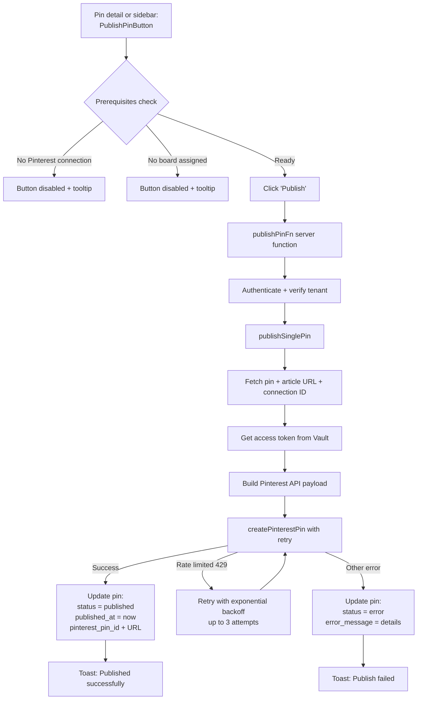
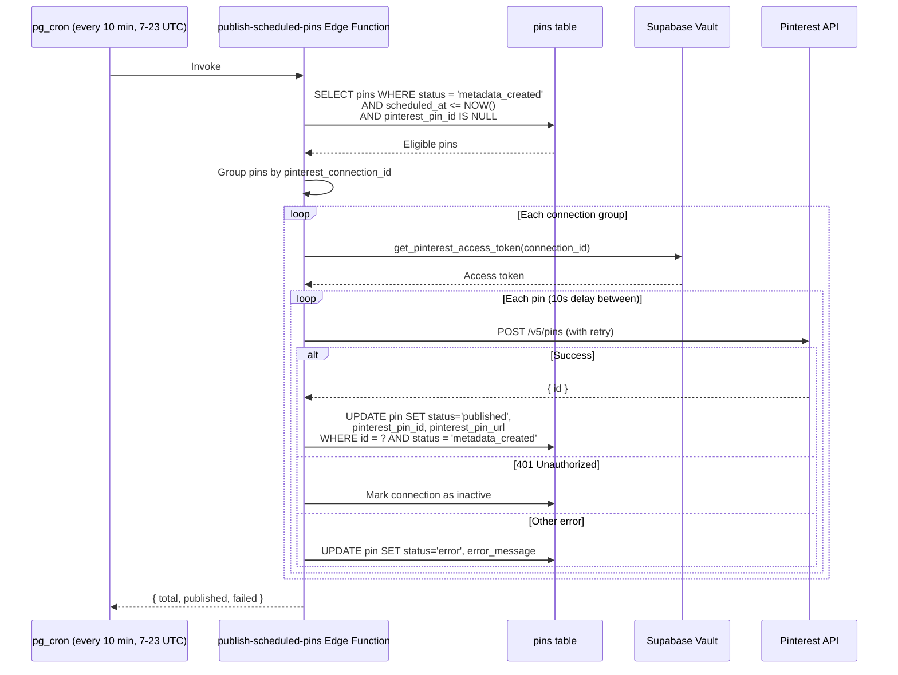
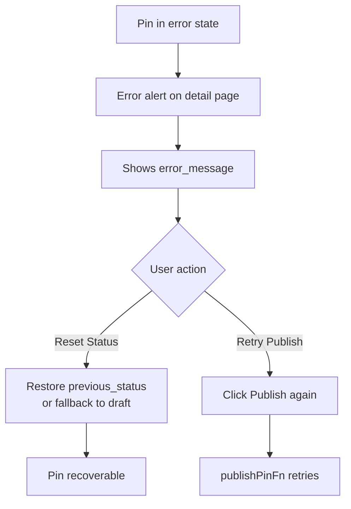
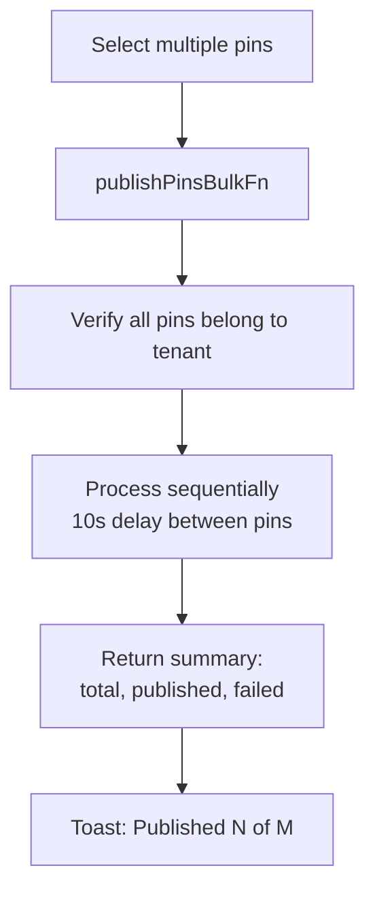

# Pin Publishing Flow

Manual publish via the UI, automatic publish via pg_cron, and error recovery. Publishing creates a pin on Pinterest via the v5 API.

For the full pin status state machine, see [Pin Status Flow](../pin-status-flow.md).

## Manual Publish



## Auto-Publish (Scheduled)



**Atomic updates:** The WHERE clause includes `status = 'metadata_created'` to prevent double-publishing if the status changed between query and update.

**Rate limiting:** 10-second delay between pins per Pinterest account to respect API limits.

## Error Recovery



When a publish fails:
- `status` is set to `error`
- `error_message` stores the failure reason
- `previous_status` preserves the pre-error status for recovery
- User can reset status and retry, or fix the issue first (e.g., reconnect Pinterest)

## Bulk Publishing



## Pinterest API Payload

The pin is published with:

```
{
  board_id:     pin.pinterest_board_id
  title:        pin.title (max 100 chars)
  description:  pin.description (max 800 chars)
  alt_text:     pin.alt_text (max 500 chars)
  link:         article.url (blog post link)
  media_source: {
    source_type: 'image_url'
    url:         public Supabase Storage URL
  }
}
```

## Publish Button States

| Pin State | Button UI |
|-----------|-----------|
| `published` with URL | Green badge + external link to Pinterest |
| `published` without URL | Green "Published" badge |
| `error` | Red retry button with rotation icon |
| No Pinterest connection | Disabled + "Connect Pinterest first" tooltip |
| No board assigned | Disabled + "Assign a board first" tooltip |
| Ready to publish | Active "Publish" button |

## Key Files

| File | Purpose |
|------|---------|
| `src/components/pins/publish-pin-button.tsx` | Publish button with prerequisite checks |
| `src/lib/server/pinterest-publishing.ts` | Server functions: `publishPinFn`, `publishPinsBulkFn`, `publishSinglePin` |
| `src/lib/server/pinterest-api.ts` | `createPinterestPin` with exponential backoff retry |
| `src/lib/hooks/use-pinterest-publishing.ts` | `usePublishPin`, `usePublishPinsBulk` hooks |
| `supabase/functions/publish-scheduled-pins/index.ts` | Auto-publish Edge Function for pg_cron |
