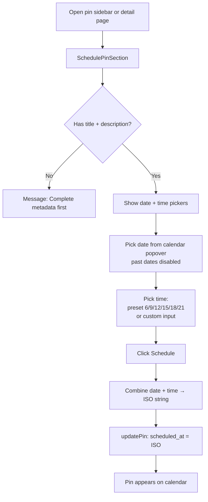
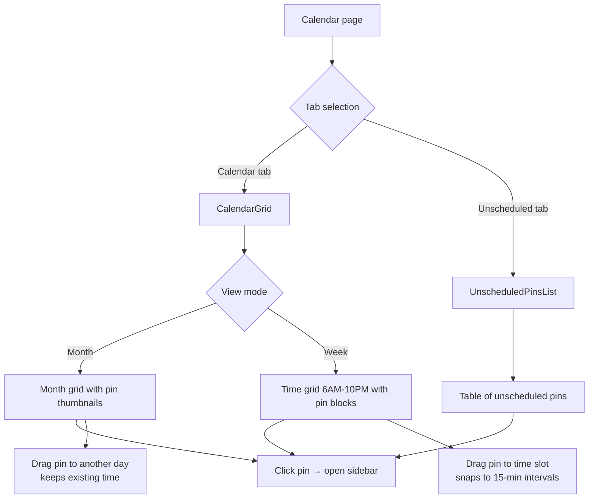
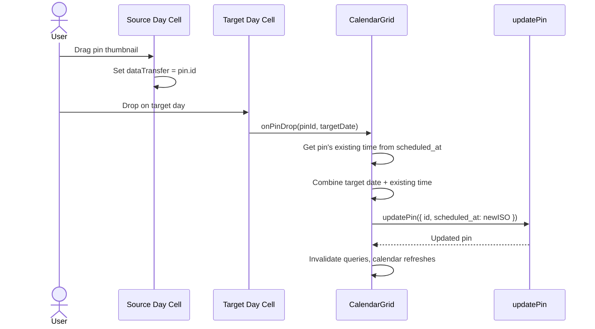
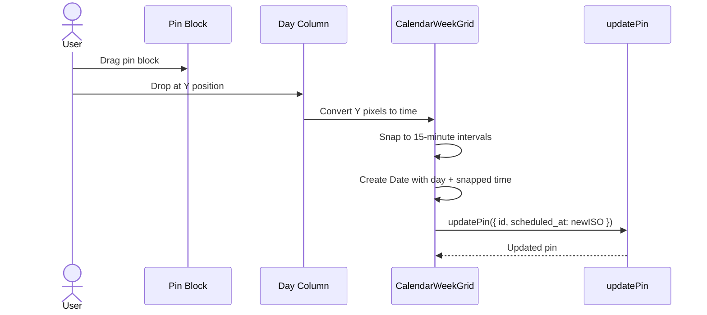
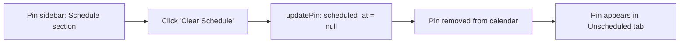

# Pin Scheduling Flow

Calendar view with month/week modes, drag-and-drop rescheduling, and an unscheduled pins tab.

## Schedule a Pin

**Prerequisites:** A pin must have `title` and `description` before it can be scheduled. This ensures metadata is ready before the pin reaches its scheduled publish time.

## Calendar Interactions

## Month View Drag & Drop

In month view, the **time is preserved** when dragging to a different day. Each day cell shows up to 6 pin thumbnails with a "+N more" overflow popover.

## Week View Drag & Drop

Week view constants:
- Hours: 6 AM to 10 PM
- Hour height: 60px (1 min ~ 1 px)
- Snap interval: 15 minutes
- Overlapping pins stack side-by-side with calculated widths

## Unschedule a Pin

## Unscheduled Pins Tab

A table view of all pins without a `scheduled_at` value:

- **Sortable by:** title, status, created_at, updated_at
- **Columns:** thumbnail, title, project name, status badge, created date
- **Click row:** Opens pin sidebar for editing/scheduling
- **Bulk selection:** Checkbox selection available (scaffold for future bulk actions)

## Calendar Navigation

- **Month/Week toggle:** Switch between views (persisted in URL search params)
- **Prev/Next:** Navigate by month or week
- **Today:** Jump to current date
- **Status filters:** Toggle which pin statuses are visible (persisted in URL)
- **Current time indicator:** Red line in week view, updates every 60 seconds

## Realtime Updates

The calendar page subscribes to Supabase Realtime for UPDATE events on the `pins` table (filtered by `blog_project_id`). Any pin change—from the sidebar, detail page, or auto-publish—triggers a cache invalidation and re-render.

## Key Files

| File | Purpose |
|------|---------|
| `src/routes/_authed/projects/$projectId/calendar.tsx` | Calendar page with tabs, filters, sidebar |
| `src/components/calendar/calendar-grid.tsx` | Month/week grid selection, drag-drop coordination |
| `src/components/calendar/calendar-header.tsx` | Navigation controls, view toggle |
| `src/components/calendar/calendar-day-cell.tsx` | Day cell with pin thumbnails, drag source/target |
| `src/components/calendar/calendar-week-grid.tsx` | Time grid, pixel-to-time conversion, overlap layout |
| `src/components/calendar/pin-sidebar.tsx` | Right-side panel for pin editing/scheduling |
| `src/components/calendar/unscheduled-pins-list.tsx` | Table of unscheduled pins with sorting |
| `src/components/pins/schedule-pin-section.tsx` | Date/time picker with presets |
