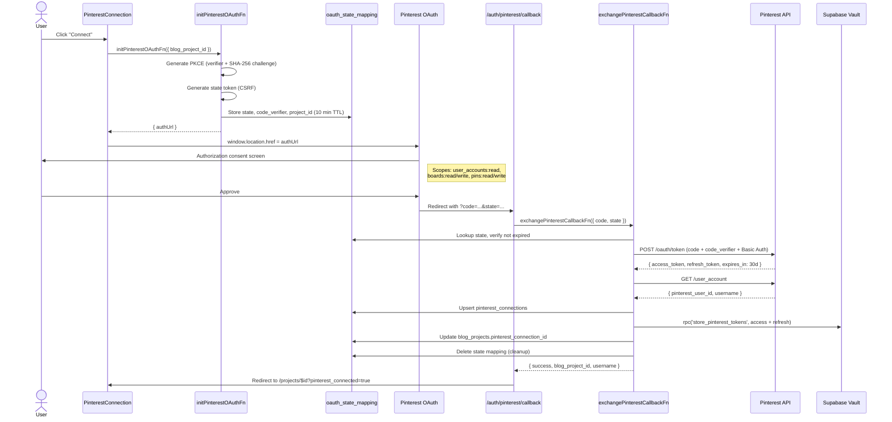
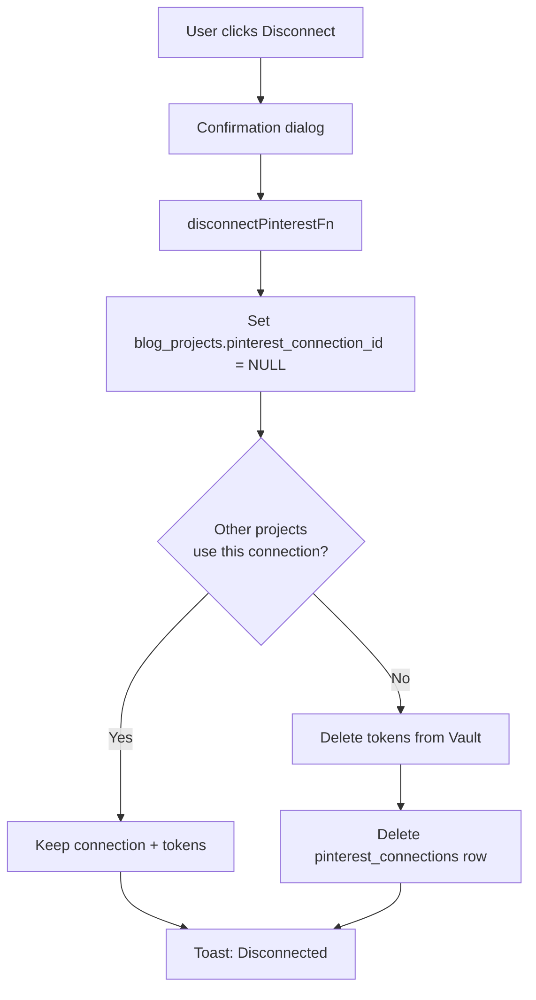

# Pinterest OAuth Flow

Connect or disconnect a Pinterest account per project using OAuth 2.0 with PKCE. Tokens are stored encrypted in Supabase Vault.

## Connect Flow

## Disconnect Flow

## Connection Status Check

The `PinterestConnection` component checks connection status on mount via `getPinterestConnectionFn()` and displays:

| State | UI |
|-------|----|
| Loading | Spinner |
| Not connected | "Connect" button |
| Connected & active | Green indicator, username, token expiry date, "Disconnect" button |
| Connected & inactive | Error alert, "Reconnect" button, "Disconnect" button |
| OAuth error (from URL param) | Error alert with "Try again" link |

The component also listens for realtime updates on the `pinterest_connections` table to reflect changes immediately.

## Security

- **PKCE S256:** Code verifier (64 bytes) never leaves the server. Challenge (SHA-256 hash) sent to Pinterest.
- **State token:** 32-byte random CSRF token with 10-minute expiration, stored in DB.
- **Token storage:** Access and refresh tokens encrypted in Supabase Vault, never exposed in API responses.
- **Shared connections:** Multiple projects within the same tenant can share one Pinterest account. Tokens are only deleted when the last project disconnects.

## Key Files

| File | Purpose |
|------|---------|
| `src/lib/server/pinterest-oauth.ts` | Server functions: init, exchange, disconnect, get status |
| `src/lib/server/pinterest-api.ts` | Pinterest API wrapper, PKCE helpers, token exchange |
| `src/routes/auth.pinterest.callback.tsx` | Callback route, validates params, triggers exchange |
| `src/components/projects/pinterest-connection.tsx` | Connection UI with connect/disconnect/status display |
| `src/types/pinterest.ts` | Type definitions for connections, tokens, OAuth state |
