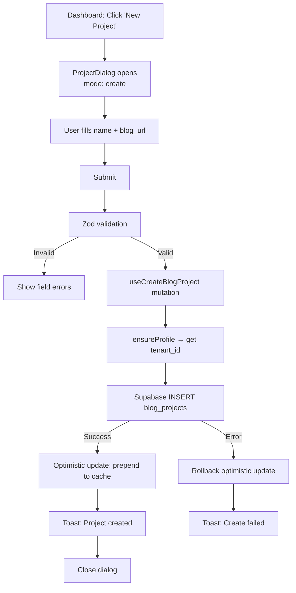
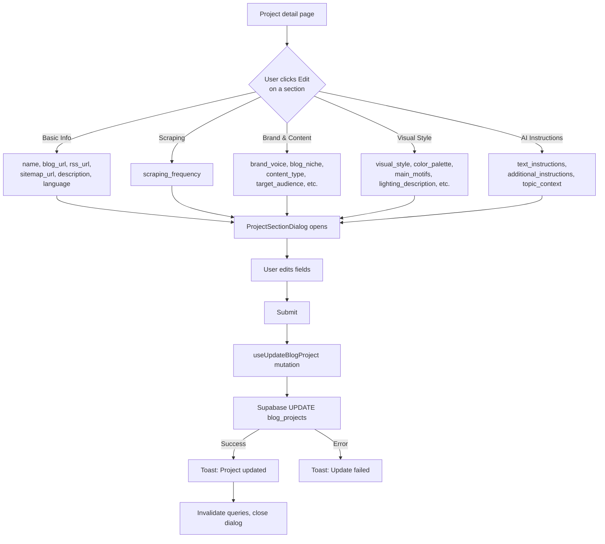
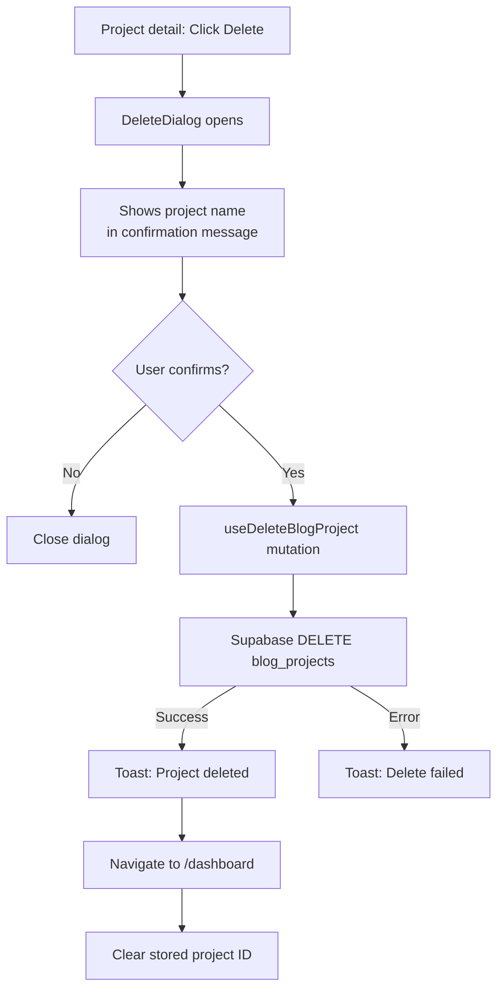

# Project Management Flow

Create, edit (by section), and delete blog projects. Projects are the top-level organizational unit; all articles, pins, and connections belong to a project.

## Create Project

The `ProjectDialog` component detects create mode when no `project` prop is passed. Only `name` and `blog_url` fields are shown for creation.

## Edit Project (Section-Based)

The project detail page organizes fields into 5 editable sections, each opened via `ProjectSectionDialog`:

The `ProjectSectionDialog` is a reusable component that accepts a `FieldConfig[]` array defining which fields to show. Field types: `input`, `textarea`, `frequency-select`. Empty strings are converted to `null` before saving.

## Delete Project

Related data (articles, pins) is cascade-deleted by the database. The `checkProjectRelatedData()` function can query article/pin counts to inform the user before deletion.

## Dashboard View

The dashboard displays all projects as cards with stats:

- **Article count** - from `blog_articles` table
- **Scheduled count** - pins with `scheduled_at` set, not yet published
- **Published count** - pins with published status

Clicking a card navigates to `/projects/$projectId`. Edit/delete icons on cards open the respective dialogs.

## Key Files

| File | Purpose |
|------|---------|
| `src/components/projects/project-dialog.tsx` | Create/edit dialog (mode via `project` prop) |
| `src/components/projects/project-section-dialog.tsx` | Granular section editing with `FieldConfig[]` |
| `src/components/projects/delete-dialog.tsx` | Delete confirmation dialog |
| `src/routes/_authed/projects/$projectId/index.tsx` | Project detail page with 5 editable sections |
| `src/routes/_authed/dashboard.tsx` | Dashboard with project cards |
| `src/components/dashboard/project-card.tsx` | Project card with stats and actions |
| `src/lib/api/blog-projects.ts` | API: `createBlogProject`, `updateBlogProject`, `deleteBlogProject` |
| `src/lib/hooks/use-blog-projects.ts` | TanStack Query hooks with optimistic create |
| `src/types/blog-projects.ts` | `BlogProject`, `BlogProjectInsert`, `BlogProjectUpdate` types |
